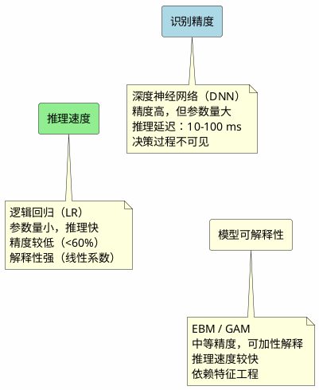

# 第1章 绪论

## 1.1 研究背景与意义

### 1.1.1 网络流量分类的重要性

网络流量分类是网络管理与安全领域的基础性任务，其目标是将网络通信流量按应用类型或服务类型进行归类。准确的流量分类结果直接支撑着多项关键网络应用：根据文献[1]，网络服务提供商（ISP）需要基于流量类型进行服务质量（QoS）调度，以保障实时交互类应用（如VoIP、视频会议）的低延迟需求；网络入侵检测系统（NIDS）[2]依赖于流量类型信息来识别异常行为，将未经分类的流量与已知攻击模式匹配；此外，流量分类结果还被广泛用于网络规划、计费系统和恶意流量检测等场景[3]。

早期的流量分类方法以**端口识别**为主。TCP/UDP 端口号在 0–1023 范围内为知名端口，由 IANA 统一分配，理论上可通过端口号直接判断应用类型。然而，随着对等网络（P2P）协议、隧道技术和端口伪装技术的普及，文献[4]的统计数据表明，至2010年前后，已有超过60%的P2P流量通过HTTP端口（80/443）传输，导致基于端口的分类准确率大幅下降。

### 1.1.2 加密流量带来的新挑战

近年来，随着TLS/SSL协议的广泛部署，互联网流量中加密流量的比例持续上升。根据Google透明度报告，Chrome浏览器加载的网页中，TLS加密连接的比例已超过95%。加密流量的广泛使用使得传统的**深度包检测**（Deep Packet Inspection，DPI）方法失效：负载内容被加密后，传统的基于明文载荷特征码匹配的方法无法提取有效信息。

加密流量的识别面临以下核心挑战：

**（1）有效特征稀缺。** 加密后，报文载荷部分不可见，传统的特征串匹配方法失去作用。分类算法必须转向利用网络流的**统计特征**（如报文长度序列、包到达时间间隔、流持续时间等）进行识别[5]。

**（2）类别不平衡。** 不同应用产生的流量规模差异巨大，Web浏览类流量远多于P2P流量，直接影响分类模型的训练稳定性和少数类的识别率。

**（3）对抗性流量。** 恶意软件可通过调整行为模式（如固定报文大小、使用常见端口）来规避基于统计特征的检测。

> **图1.1** 展示了加密流量识别任务中精度、推理速度和可解释性三者之间的制约关系。传统深度学习模型（如DNN、CNN）在大规模加密流量数据集上可达到较高的识别精度（如ResNet在CIFAR-100上的top-1准确率超过90%），但其推理延迟通常在数十至数百毫秒量级，难以满足实时检测需求[6]。可解释性方面，深度模型的"黑箱"特性使得安全分析人员无法理解其决策依据，这在安全关键场景中是不可接受的。

### 1.1.3 资源受限场景下的实时性需求

在移动终端、边缘网关和嵌入式设备等资源受限环境中，模型必须满足严格的计算资源和功耗约束。以5G移动边缘计算（MEC）场景为例，流量检测通常需要在设备端完成，以减少数据回传带来的延迟和带宽开销。然而，文献[7]指出，复杂的深度学习模型在ARM Cortex-A系列处理器上的推理延迟通常超过50ms，无法满足毫秒级的实时性要求。

与此同时，**知识蒸馏**（Knowledge Distillation，KD）[8]提供了一种将大模型能力迁移到小模型的范式。Hinton等人[8]提出，教师模型的soft label（软标签）包含了比hard label更丰富的类别间相似性信息，通过蒸馏策略可使小规模学生模型学习到教师模型的广义知识，从而在保持轻量化的同时逼近教师精度。这为解决精度-速度矛盾提供了新的技术路径。

### 1.1.4 可解释性的现实需求

在网络安全领域，**可解释性**不仅是合规要求，更是运维决策的关键支撑。文献[9]指出，模型的可解释性至少在以下三个方面具有不可替代的价值：其一，安全分析师需要理解模型为何将某条流量标记为异常，以便进一步人工研判；其二，当模型发生误判时，可解释输出可以帮助定位错误来源并指导模型迭代；其三，在某些受监管行业（如金融、电力），AI决策必须具备可审计性。

传统的深度学习模型属于"端到端"黑箱，其决策机制难以被人类理解。文献[10]系统梳理了可解释人工智能（XAI）的主要方法，将其分为事后解释（post-hoc explanation）和内在可解释模型（intrinsically interpretable model）两类。前者通过LIME、SHAP等方法对已训练的黑箱模型进行近似解释，但解释结果存在不稳定性和忠实度问题[11]；后者则通过模型结构设计本身保证解释性，如广义加性模型（Generalized Additive Model，GAM）[12]、决策规则列表[13]等。

**可解释增强回归**（Explainable Boosting Machine，EBM）[14]是一种基于GAM的内在可解释模型。EBM将预测函数建模为各特征的独立形状函数之和，其数学形式为：

$$g(f(\mathbf{x})) = \sum_{j=1}^{p} f_j(x_j)$$

其中 $f_j$ 表示第 $j$ 个特征的形状函数（shape function），$p$ 为特征总数。EBM通过交替方向乘子法（ADMM）进行训练，每一步仅更新单个特征的形状函数，从而天然保证特征之间的加性效应可分离——对任意预测结果，可直接读取每个特征对最终输出的贡献值，无需额外的解释方法。文献[14]在多个表格数据集上的实验表明，EBM在保持与Random Forest相当精度的同时，推理速度显著快于后者，且输出具有天然可加性解释。

### 1.1.5 本文的研究目标

基于上述分析，本文的研究目标可归纳为：

**（1）构建一个同时满足高精度、快推理、强可解释三个目标的轻量化加密流量识别系统。** 该系统应能在标准加密流量数据集上达到与深度模型相当的识别精度（>90%准确率），同时将推理延迟控制在1ms以下，并直接输出可解释的流量分类依据。

**（2）设计基于知识蒸馏的模型压缩方案。** 以TabularTransformer作为教师模型，利用其self-attention机制捕捉流内特征交互关系；以EBM作为学生模型，利用其加性结构天然输出的特征贡献作为可解释性依据。教师模型通过soft label蒸馏将类别间的相似性知识传递给学生，使学生在保持可解释结构的前提下逼近教师的识别性能。

**（3）实现可复现的实验验证。** 在公开加密流量数据集上开展对比实验与消融实验，定量评估精度、延迟和可解释性三个维度的指标，证明所提方法在综合性能上的优势。

## 1.2 国内外研究现状

### 1.2.1 基于端口和深度包检测的方法

基于端口的流量分类方法是最早被广泛使用的方案，其核心思想是利用TCP/UDP端口号与特定应用之间的对应关系进行识别。该方法计算复杂度低、实现简单，在早期互联网环境下取得了较好的效果。然而，随着P2P协议和端口伪装技术的普及，文献[4]的实测数据表明，单纯基于端口的分类准确率已降至40%以下。

**深度包检测**（DPI）通过解析加密前的握手报文（如TLS ClientHello中的SNI扩展、JA3指纹等）来识别流量类型。文献[15]利用TLS握手中的服务器名称指示（SNI）和证书信息实现了高达98%的分类准确率。然而，DPI方法存在两个根本性局限：其一，加密TLS 1.3流量中，握手机制也有所简化，且服务器证书可在连接建立后加密传输；其二，在隐私合规要求下（如GDPR），深度检测可能涉及用户数据处理合规问题。

### 1.2.2 基于机器学习的方法

针对DPI方法的局限性，基于机器学习（ML）的流量分类方法转向利用**流统计特征**进行识别。这类方法通常先通过NetFlow或CICFlowMeter等工具提取流的统计特征（如持续时间、字节数统计量、包间时间间隔等），再使用传统ML分类器（如SVM、Random Forest、朴素贝叶斯等）进行识别。

文献[16]使用Random Forest对ISCX-VPN-NonVPN数据集进行分类，在7类应用上取得了93.2%的准确率。文献[17]对比了多种传统ML方法在加密流量分类任务上的表现，发现Random Forest和Gradient Boosting在处理高维流统计特征时表现最优。然而，传统ML方法依赖于人工设计的特征工程，特征选取的质量直接决定分类性能的上限，且难以捕捉特征之间的非线性交互关系。

### 1.2.3 基于深度学习的方法

近年来，深度学习方法凭借其自动特征学习的能力，在加密流量分类领域取得了显著进展。主要方法可分为以下几类：

**（1）基于卷积神经网络（CNN）的方法。** 这类方法通常将流量数据转换为二维特征图或时间序列形式，利用卷积核自动提取局部特征。文献[18]将流统计特征归一化后组成向量，训练一维CNN进行分类，在ISCX-VPN数据集上达到了96%以上的准确率。文献[19]提出了FlowGAN方法，将流量特征建模为序列数据并使用生成对抗网络进行数据增强，间接提升了分类性能。

**（2）基于循环神经网络（RNN/LSTM）的方法。** 考虑到网络流具有天然的时序特性，LSTM和GRU等模型被用于捕捉流内报文间的时序依赖关系。文献[20]使用双向LSTM处理流量包的到达时间序列，在混合加密流量数据集上取得了较好的效果。

**（3）基于Transformer的方法。** 受自然语言处理中Transformer成功的启发，文献[21]首次将self-attention机制引入表格数据分类，提出TabTransformer模型。该模型通过逐层的自注意力交互建模特征之间的依赖关系，在多个表格分类基准上超越了传统的GDBT方法。文献[22]将TabTransformer应用于加密流量识别，通过对流特征序列的建模取得了优于MLP和CNN的结果。

深度学习方法在精度上取得了优异表现，但其**推理效率**和**可解释性**问题仍然突出。文献[6]的评测数据表明，标准的ResNet类模型在CPU上的单样本推理延迟可达数十毫秒，难以满足实时检测需求；同时，深度模型的决策过程难以解释，限制了其在安全关键场景中的部署。

### 1.2.4 现有方法的局限性分析

综合上述研究现状，可以将现有方法的主要局限归纳如下：

**精度与效率难以兼得。** 深度学习方法在精度上具有明显优势，但推理延迟较高；传统ML方法和轻量级模型推理速度快，但精度受限。两者之间缺乏有效的平衡机制。

**可解释性不足。** 大多数深度学习分类器以"端到端"方式运行，其决策机制不可见。事后解释方法（如SHAP、LIME）的解释结果存在忠实度问题[11]，且解释过程本身增加了计算开销。

**蒸馏-可解释性结合的研究较少。** 现有的知识蒸馏研究大多以神经网络作为学生模型，鲜有工作将蒸馏与内在可解释模型相结合，以同时获得高效推理与可解释输出。

## 1.3 研究内容与创新点

针对上述局限性，本文的研究内容与创新点主要包括以下三个方面：

**（1）提出教师-学生协同蒸馏框架。** 以TabularTransformer作为教师模型，充分利用self-attention机制对流特征之间交互关系的建模能力，训练一个精度较高的教师网络；以可解释增强回归（EBM）作为学生模型，利用其加性结构直接输出特征级别的分类贡献。通过软标签蒸馏将教师模型习得的类别间相似性知识迁移至学生模型，使学生在保持可解释结构的同时逼近教师的识别精度。

**（2）设计面向表格数据的知识蒸馏策略。** 针对网络流统计特征为典型高维表格数据的特点，改进了蒸馏损失函数中的温度参数设置和软硬标签加权方式，并引入流特征重要性作为辅助监督信号，进一步提升蒸馏效果。

**（3）构建完整的轻量化可解释加密流量识别系统。** 系统包含教师模型训练、学生模型蒸馏、精度-延迟-可解释性联合评估四个环节，在公开数据集上进行充分的对比实验和消融实验，全面验证所提方法在三个维度上的综合性能。

## 1.4 论文组织结构

本文共分为五章，各章内容安排如下：

**第1章 绪论。** 阐述加密流量分类的研究背景与意义，分析现有方法的不足，明确本文的研究目标和主要贡献。

**第2章 相关技术与理论基础。** 介绍加密流量识别的技术基础，包括NetFlow流统计特征、常用分类模型；阐述知识蒸馏的基本原理与关键技术；介绍可解释增强回归（EBM）的数学模型与训练方法。

**第3章 轻量化可解释加密流量识别系统设计。** 详细描述系统的总体架构，教师模型TabularTransformer和学生模型EBM的结构设计，以及知识蒸馏的具体实现方案。

**第4章 实验与结果分析。** 介绍实验环境与数据集设计，从识别精度、推理延迟、可解释性输出三个维度进行综合评估，并与多种基线方法进行对比分析。

**第5章 总结与展望。** 总结本文的研究工作，梳理主要结论，并提出未来可能的研究方向。
